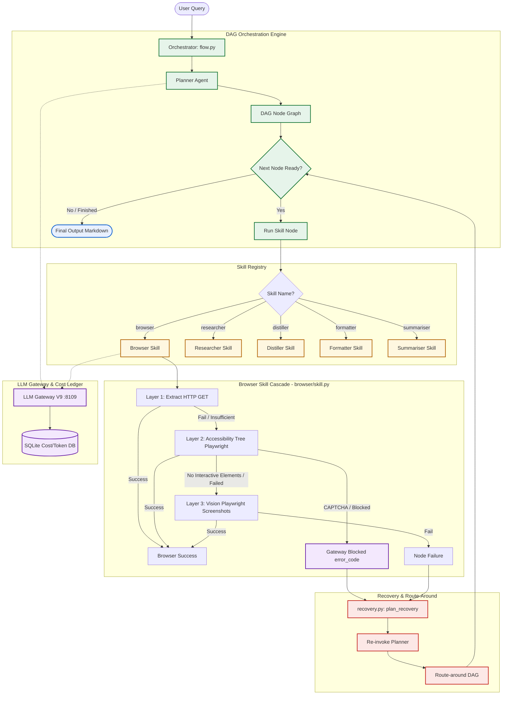

# EAGV3: Growing-Graph Multi-Agent Orchestration & Browser Cascade (Session 9)

An advanced multi-agent orchestrator framework designed to execute complex tasks by dynamically generating and executing Directed Acyclic Graphs (DAGs) of specialized agent skills. It integrates a **three-tier Browser Skill cascade** (Extract, Accessibility tree, and Vision) with robust runtime recovery mechanisms and cost-attribution tracking.

---

## 🏗️ Solution Architecture

The framework coordinates task execution by separating graph orchestration, skill execution, recovery routing, and LLM provider gateway management. Below is the solution architecture diagram:



---

## 🛠️ Core Components

1. **Orchestrator Engine ([flow.py](file:///c:/manish/SchoolOfAI/session9/S9SharedCode/code/flow.py))**
   - Parses the query and runs a NetworkX Directed Acyclic Graph (DAG) loop.
   - Manages execution paths, resolves outputs, and manages node states (`pending`, `running`, `complete`, `skipped`).
   - Splicing of dynamic successors, critic checks, and recovery paths at runtime.

2. **Skill Registry ([skills.py](file:///c:/manish/SchoolOfAI/session9/S9SharedCode/code/skills.py))**
   - Routes executions to specialized sub-agents:
     - **Browser**: Interacts with websites through Playwright or fast parser.
     - **Researcher**: Standard web search (using DuckDuckGo or Tavily search).
     - **Distiller**: Extracts specific schema fields or lists from raw text.
     - **Formatter**: Prepares final user-facing responses.
     - **Summariser**: Summarizes long text inputs.

3. **Browser Skill Cascade ([browser/skill.py](file:///c:/manish/SchoolOfAI/session9/S9SharedCode/code/browser/skill.py))**
   - **Layer 1 (Extract)**: Local parsing of static content using `trafilatura` to avoid LLM cost and browser spin-up.
   - **Layer 2 (Accessibility - a11y)**: Launches a Playwright browser instance, parses the Accessibility tree, and runs step-by-step element actions (click, fill, scroll, drag) with LLM instruction feedback.
   - **Layer 3 (Vision)**: Escalates to visual mode when elements cannot be discovered in the DOM (e.g. canvas elements). Captures page screenshots, overlays coordinate highlights, and interacts using vision LLM models.
   - **CAPTCHA Detection**: Inspects DOM/A11y signatures for gateway challenges (e.g. Cloudflare, Redfin blockages) and throws `gateway_blocked` to trigger orchestrator route-around.

4. **Error Recovery ([recovery.py](file:///c:/manish/SchoolOfAI/session9/S9SharedCode/code/recovery.py))**
   - Intercepts failed nodes (e.g. Captchas or runtime failures).
   - Dynamically re-invokes the Planner to calculate alternate path options (e.g. route-around from Browser to Researcher) instead of looping indefinitely.

5. **LLM Gateway V9 ([llm_gatewayV9/main.py](file:///c:/manish/SchoolOfAI/session9/llm_gatewayV9/main.py))**
   - Central LLM call routing service running locally on port `8109`.
   - Directs prompts to different LLM Backends (Gemini, GitHub Models, Groq) with failover.
   - Records detailed token usage metrics and dollar cost tracking by agent signature (`browser`, `planner`, `distiller`, etc.).

---

## 🚀 Getting Started

### 📋 Prerequisites

Ensure Python `3.11+` and `uv` package manager are installed.

```bash
# Verify uv installation
uv --version
```

### ⚙️ Setup Environment

1. Clone or navigate to the project root.
2. Initialize environment files:
   ```bash
   cp S9SharedCode/code/.env.example S9SharedCode/code/.env
   ```
3. Set your API credentials in `S9SharedCode/code/.env` (e.g., Gemini / GitHub / Groq keys).

4. Install dependencies:
   ```bash
   cd S9SharedCode/code
   uv sync
   uv run playwright install chromium
   ```

### 🖥️ Running the LLM Gateway

The gateway must be active on port `8109` before executing queries.

```bash
cd llm_gatewayV9
uv run main.py
```

### 🏃 Running Queries

You can execute queries via the orchestration entry point [flow.py](file:///c:/manish/SchoolOfAI/session9/S9SharedCode/code/flow.py):

```bash
cd S9SharedCode/code
uv run python flow.py "Compare top 3 Hugging Face text-generation models sorted by likes."
```

---

## 🧪 Demonstration Scenarios

The test framework includes a series of pre-configured demo cases in `S9SharedCode/run_demo.sh` to exercise different capabilities:

| Command | Target Scenario / Flow | Demonstrated Capability |
| :--- | :--- | :--- |
| `bash run_demo.sh tests` | Pytest suite execution | Validates agent graph state recovery, critic injection, and recovery logic. |
| `bash run_demo.sh hello` | `planner -> formatter` | Minimal DAG. Directly formats a response without researching. |
| `bash run_demo.sh shannon` | `planner -> researcher -> formatter` | Single-step information retrieval and formatting. |
| `bash run_demo.sh populations` | `planner -> researcher x 3 (parallel) -> formatter` | Parallel worker routing and strict local scoping (preventing prompt leak). |
| `bash run_demo.sh structured` | `planner -> researcher -> distiller -> critic -> formatter` | Structured field parsing and automatic runtime injection of a Critic agent. |
| `bash run_demo.sh fail` | `planner -> formatter` (graceful exit) | Graceful fail-by-planning when inputs are impossible (e.g. nonexistent paths). |
| `bash run_demo.sh browser` | `planner -> browser -> distiller -> formatter` | Browser skill cascade exercising Extract, A11y, or Vision paths. |
| `bash run_demo.sh wipe` | System reset | Wipes session logs, output artifacts, and FAISS vector index database. |

---

## 🧹 Local State Reset

To clear old execution memory, output artifacts, and vector indices:

```bash
cd S9SharedCode
bash run_demo.sh wipe
```

## Query Logs


(base) C:\manish\SchoolOfAI\session9\S9SharedCode\code>py -X utf8 flow.py "Compare 3 laptops under ₹80,000."

══════════════════════════════════════════════════════════════════════════════
session s8-42650ce2  ─  query: Compare 3 laptops under ₹80,000.
══════════════════════════════════════════════════════════════════════════════
[memory.read] 1 hit(s) visible to every skill this run
[debug parse_skill_json] RAW TEXT:
{"rationale": "Fetch three laptops under ₹80,000 from Flipkart, then compare.", "nodes": [
{"skill": "browser", "inputs": [], "metadata": {"label": "bFlipkart", "url": "https://www.flipkart.com/search?q=laptops+under+80000", "goal": "filter by Price: ₹40,001 - ₹80,000; then extract top 3 laptops"}},
{"skill": "distiller", "inputs": ["USER_QUERY", "n:bFlipkart"], "metadata": {"label": "dLaptops"}},
{"skill": "formatter", "inputs": ["USER_QUERY", "n:dLaptops", "n:bFlipkart"], "metadata": {"label": "out"}}
]}
---
[n:1] planner            complete (17.6s)
[driver] pausing 2s before Turn 2 to respect provider TPM limits...
[driver] pausing 2s before Turn 3 to respect provider TPM limits...
[driver] pausing 2s before Turn 4 to respect provider TPM limits...

================================================================================
 BROWSER AGENT REPLAY REPORT
================================================================================
1. Original user goal: filter by Price: ₹40,001 - ₹80,000; then extract top 3 laptops
--------------------------------------------------------------------------------
2. Planner DAG: planner ──> Browser ──> distiller ──> formatter
--------------------------------------------------------------------------------
3. Browser path chosen: a11y
--------------------------------------------------------------------------------
4. Browser actions taken:
  [Turn 1] click(13), type(13) ──> ok | ok
  [Turn 2] type(13) ──> ok
  [Turn 3] type(12), type(13) ──> ok | ok
  [Turn 4] done() ──> done(True)
--------------------------------------------------------------------------------
5. Screenshots or page-state logs:
  [Screenshot 1] state/artifacts/screenshots/s8-42650ce2_a11y_turn_01_raw.png
  [Screenshot 2] state/artifacts/screenshots/s8-42650ce2_a11y_turn_02_raw.png
  [Screenshot 3] state/artifacts/screenshots/s8-42650ce2_a11y_turn_03_raw.png
  [Screenshot 4] state/artifacts/screenshots/s8-42650ce2_a11y_turn_04_raw.png
  [Turn 1] URL: https://www.flipkart.com/search?q=laptops+under+80000
  [Turn 2] URL: https://www.flipkart.com/search?q=laptops+under+80000
  [Turn 3] URL: https://www.flipkart.com/search?q=laptops+under+80000
  [Turn 4] URL: https://www.flipkart.com/search?q=laptops+under+80000
--------------------------------------------------------------------------------
6. Extracted Data:
  (Structured data available in JSON output)
--------------------------------------------------------------------------------
7. Final comparison table:
| Rank | Name | Price | Processor | RAM | Operating System | Ratings | Reviews |
|---|---|---|---|---|---|---|---|
| 1 | ASUS Vivobook 15 (2025) (i5... | ₹59,000 | Intel Core 5 Processor | 16 GB DDR4 | Windows 11 Home | 1,656 | 112 |
| 2 | ASUS Expertbook P1 with 1 Y... | ₹42,990 | Intel Core i3 Processor (13th Gen) | 8 GB DDR5 | Windows 11 Home | 6,173 | 495 |
| 3 | MOTOROLA Motobook 60 Pro Fu... | ₹69,990 | Intel Core Ultra 5 Processor | 16 GB DDR5 | 64 bit Windows 11 | 932 | 136 |
--------------------------------------------------------------------------------
8. Turn count and cost summary:
  Total Turns:     4
  Input Tokens:    6172
  Output Tokens:   359
  Estimated Cost:  $0.000000
  Wall Clock Time: 61.48s
================================================================================

[n:2] browser            complete (61.5s)
[debug parse_skill_json] RAW TEXT:
{
  "fields": {
    "comparison_table": "| Rank | Name | Price | Processor | RAM | Operating System | Ratings | Reviews |\n|---|---|---|---|---|---|---|---|\n| 1 | ASUS Vivobook 15 (2025) (i5... | ₹59,000 | Intel Core 5 Processor | 16 GB DDR4 | Windows 11 Home | 1,656 | 112 |\n| 2 | ASUS Expertbook P1 with 1 Y... | ₹42,990 | Intel Core i3 Processor (13th Gen) | 8 GB DDR5 | Windows 11 Home | 6,173 | 495 |\n| 3 | MOTOROLA Motobook 60 Pro Fu... | ₹69,990 | Intel Core Ultra 5 Processor | 16 GB DDR5 | 64 bit Windows 11 | 932 | 136 |"
  },
  "rationale": "Extracted data from browser output supports the comparison table."
}
---
[n:3] distiller          complete (17.5s)
[debug parse_skill_json] RAW TEXT:
{
  "final_answer": "Here is a comparison of the top 3 laptops under ₹80,000:\n\n| Rank | Name | Price | Processor | RAM | Operating System | Ratings | Reviews |\n|---|---|---|---|---|---|---|---|\n| 1 | ASUS Vivobook 15 (2025) (i5... | ₹59,000 | Intel Core 5 Processor | 16 GB DDR4 | Windows 11 Home | 1,656 | 112 |\n| 2 | ASUS Expertbook P1 with 1 Y... | ₹42,990 | Intel Core i3 Processor (13th Gen) | 8 GB DDR5 | Windows 11 Home | 6,173 | 495 |\n| 3 | MOTOROLA Motobook 60 Pro Fu... | ₹69,990 | Intel Core Ultra 5 Processor | 16 GB DDR5 | 64 bit Windows 11 | 932 | 136 |\n\n================================================================================\n BROWSER AGENT REPLAY REPORT\n================================================================================\n1. Original user goal: filter by Price: ₹40,001 - ₹80,000; then extract top 3 laptops\n--------------------------------------------------------------------------------\n2. Planner DAG: planner ──> Browser ──> distiller ──> formatter\n--------------------------------------------------------------------------------\n3. Browser path chosen: a11y\n--------------------------------------------------------------------------------\n4. Browser actions taken:\n [Turn 1] click(13), type(13) ──> ok | ok\n [Turn 2] type(13) ──> ok\n [Turn 3] type(12), type(13) ──> ok | ok\n [Turn 4] done() ──> done(True)\n--------------------------------------------------------------------------------\n5. Screenshots or page-state logs:\n [Screenshot 1] state/artifacts/screenshots/s8-42650ce2_a11y_turn_01_raw.png\n [Screenshot 2] state/artifacts/screenshots/s8-42650ce2_a11y_turn_02_raw.png\n [Screenshot 3] state/artifacts/screenshots/s8-42650ce2_a11y_turn_03_raw.png\n [Screenshot 4] state/artifacts/screenshots/s8-42650ce2_a11y_turn_04_raw.png\n [Turn 1] URL: https://www.flipkart.com/search?q=laptops+under+80000\n [Turn 2] URL: https://www.flipkart.com/search?q=laptops+under+80000\n [Turn 3] URL: https://www.flipkart.com/search?q=laptops+under+80000\n [Turn 4] URL: https://www.flipkart.com/search?q=laptops+under+80000\n--------------------------------------------------------------------------------\n6. Extracted Data:\n (Structured data available in JSON output)\n--------------------------------------------------------------------------------\n7. Final comparison table:\n| Rank | Name | Price | Processor | RAM | Operating System | Ratings | Reviews |\n|---|---|---|---|---|---|---|---|\n| 1 | ASUS Vivobook 15 (2025) (i5... | ₹59,000 | Intel Core 5 Processor | 16 GB DDR4 | Windows 11 Home | 1,656 | 112 |\n| 2 | ASUS Expertbook P1 with 1 Y... | ₹42,990 | Intel Core i3 Processor (13th Gen) | 8 GB DDR5 | Windows 11 Home | 6,173 | 495 |\n| 3 | MOTOROLA Motobook 60 Pro Fu... | ₹69,990 | Intel Core Ultra 5 Processor | 16 GB DDR5 | 64 bit Windows 11 | 932 | 136 |\n--------------------------------------------------------------------------------\n8. Turn count and cost summary:\n Total Turns: 4\n Input Tokens: 6172\n Output Tokens: 359\n Estimated Cost: $0.000000\n Wall Clock Time: 61.48s\n================================================================================"
}
---
[n:4] formatter          complete (71.5s)

══════════════════════════════════════════════════════════════════════════════
FINAL:
Here is a comparison of the top 3 laptops under ₹80,000:

| Rank | Name | Price | Processor | RAM | Operating System | Ratings | Reviews |
|---|---|---|---|---|---|---|---|
| 1 | ASUS Vivobook 15 (2025) (i5... | ₹59,000 | Intel Core 5 Processor | 16 GB DDR4 | Windows 11 Home | 1,656 | 112 |
| 2 | ASUS Expertbook P1 with 1 Y... | ₹42,990 | Intel Core i3 Processor (13th Gen) | 8 GB DDR5 | Windows 11 Home | 6,173 | 495 |
| 3 | MOTOROLA Motobook 60 Pro Fu... | ₹69,990 | Intel Core Ultra 5 Processor | 16 GB DDR5 | 64 bit Windows 11 | 932 | 136 |

================================================================================
 BROWSER AGENT REPLAY REPORT
================================================================================
1. Original user goal: filter by Price: ₹40,001 - ₹80,000; then extract top 3 laptops
--------------------------------------------------------------------------------
2. Planner DAG: planner ──> Browser ──> distiller ──> formatter
--------------------------------------------------------------------------------
3. Browser path chosen: a11y
--------------------------------------------------------------------------------
4. Browser actions taken:
 [Turn 1] click(13), type(13) ──> ok | ok
 [Turn 2] type(13) ──> ok
 [Turn 3] type(12), type(13) ──> ok | ok
 [Turn 4] done() ──> done(True)
--------------------------------------------------------------------------------
5. Screenshots or page-state logs:
 [Screenshot 1] state/artifacts/screenshots/s8-42650ce2_a11y_turn_01_raw.png
 [Screenshot 2] state/artifacts/screenshots/s8-42650ce2_a11y_turn_02_raw.png
 [Screenshot 3] state/artifacts/screenshots/s8-42650ce2_a11y_turn_03_raw.png
 [Screenshot 4] state/artifacts/screenshots/s8-42650ce2_a11y_turn_04_raw.png
 [Turn 1] URL: https://www.flipkart.com/search?q=laptops+under+80000
 [Turn 2] URL: https://www.flipkart.com/search?q=laptops+under+80000
 [Turn 3] URL: https://www.flipkart.com/search?q=laptops+under+80000
 [Turn 4] URL: https://www.flipkart.com/search?q=laptops+under+80000
--------------------------------------------------------------------------------
6. Extracted Data:
 (Structured data available in JSON output)
--------------------------------------------------------------------------------
7. Final comparison table:
| Rank | Name | Price | Processor | RAM | Operating System | Ratings | Reviews |
|---|---|---|---|---|---|---|---|
| 1 | ASUS Vivobook 15 (2025) (i5... | ₹59,000 | Intel Core 5 Processor | 16 GB DDR4 | Windows 11 Home | 1,656 | 112 |
| 2 | ASUS Expertbook P1 with 1 Y... | ₹42,990 | Intel Core i3 Processor (13th Gen) | 8 GB DDR5 | Windows 11 Home | 6,173 | 495 |
| 3 | MOTOROLA Motobook 60 Pro Fu... | ₹69,990 | Intel Core Ultra 5 Processor | 16 GB DDR5 | 64 bit Windows 11 | 932 | 136 |
--------------------------------------------------------------------------------
8. Turn count and cost summary:
 Total Turns: 4
 Input Tokens: 6172
 Output Tokens: 359
 Estimated Cost: $0.000000
 Wall Clock Time: 61.48s
================================================================================
══════════════════════════════════════════════════════════════════════════════

(base) C:\manish\SchoolOfAI\session9\S9SharedCode\code>py -X utf8 flow.py "Compare 5 AI coding tools by free plan and paid plan."

══════════════════════════════════════════════════════════════════════════════
session s8-85265c67  ─  query: Compare 5 AI coding tools by free plan and paid plan.
══════════════════════════════════════════════════════════════════════════════
[debug parse_skill_json] RAW TEXT:
{
  "rationale": "Fetch each AI coding tool's free and paid plans in parallel, then compare.",
  "nodes": [
    {
      "skill": "browser",
      "inputs": [],
      "metadata": {
        "label": "b1",
        "url": "https://www.kite.com/pricing/",
        "goal": "extract free and paid plans"
      }
    },
    {
      "skill": "browser",
      "inputs": [],
      "metadata": {
        "label": "b2",
        "url": "https://www.deepcode.ai/pricing/",
        "goal": "extract free and paid plans"
      }
    },
    {
      "skill": "browser",
      "inputs": [],
      "metadata": {
        "label": "b3",
        "url": "https://www.tabnine.com/pricing/",
        "goal": "extract free and paid plans"
      }
    },
    {
      "skill": "browser",
      "inputs": [],
      "metadata": {
        "label": "b4",
        "url": "https://www.coder.com/pricing/",
        "goal": "extract free and paid plans"
      }
    },
    {
      "skill": "browser",
      "inputs": [],
      "metadata": {
        "label": "b5",
        "url": "https://www.github.com/codex/pricing/",
        "goal": "extract free and paid plans"
      }
    },
    {
      "skill": "distiller",
      "inputs": ["USER_QUERY", "n:b1", "n:b2", "n:b3", "n:b4", "n:b5"],
      "metadata": {
        "label": "d1"
      }
    },
    {
      "skill": "formatter",
      "inputs": ["USER_QUERY", "n:d1", "n:b1", "n:b2", "n:b3", "n:b4", "n:b5"],
      "metadata": {
        "label": "out"
      }
    }
  ]
}
---
[n:1] planner            complete (27.9s)
[driver] pausing 2s before Turn 2 to respect provider TPM limits...
[driver] pausing 2s before Turn 2 to respect provider TPM limits...

================================================================================
 BROWSER AGENT REPLAY REPORT
================================================================================
1. Original user goal: extract free and paid plans
--------------------------------------------------------------------------------
2. Planner DAG: planner ──> Browser ──> distiller ──> formatter
--------------------------------------------------------------------------------
3. Browser path chosen: a11y
--------------------------------------------------------------------------------
4. Browser actions taken:
  [Turn 1] click(5) ──> ok
  [Turn 2] done() ──> done(True)
--------------------------------------------------------------------------------
5. Screenshots or page-state logs:
  [Screenshot 1] state/artifacts/screenshots/s8-85265c67_a11y_turn_01_raw.png
  [Screenshot 2] state/artifacts/screenshots/s8-85265c67_a11y_turn_02_raw.png
  [Turn 1] URL: https://snyk.io/platform/deepcode-ai/
  [Turn 2] URL: https://snyk.io/plans/
--------------------------------------------------------------------------------
6. Extracted Data:
  (Structured data available in JSON output)
--------------------------------------------------------------------------------
7. Final comparison table:
| Plan Name | Target Audience | Price | Key Features |
|---|---|---|---|
| Ignite | For organizations with less than 50 developers looking for an Enterprise-grade platform to layer security into their AI development practices. | $1,260/year per contributing developer | Range of testing across SDLC, 10 DAST targets included, Includes SCA, SAST, IaC, and Container, Advanced risk factors help prioritize, Advanced analytics to assess programs |
--------------------------------------------------------------------------------
8. Turn count and cost summary:
  Total Turns:     2
  Input Tokens:    2041
  Output Tokens:   99
  Estimated Cost:  $0.000000
  Wall Clock Time: 20.37s
================================================================================

[driver] pausing 2s before Turn 3 to respect provider TPM limits...
[driver] pausing 2s before Turn 4 to respect provider TPM limits...

================================================================================
 BROWSER AGENT REPLAY REPORT
================================================================================
1. Original user goal: extract free and paid plans
--------------------------------------------------------------------------------
2. Planner DAG: planner ──> Browser ──> distiller ──> formatter
--------------------------------------------------------------------------------
3. Browser path chosen: a11y
--------------------------------------------------------------------------------
4. Browser actions taken:
  [Turn 1] done() ──> done(True)
--------------------------------------------------------------------------------
5. Screenshots or page-state logs:
  [Screenshot 1] state/artifacts/screenshots/s8-85265c67_a11y_turn_01_raw.png
  [Turn 1] URL: https://www.tabnine.com/pricing/
--------------------------------------------------------------------------------
6. Extracted Data:
  (Structured data available in JSON output)
--------------------------------------------------------------------------------
7. Final comparison table:
| Plan Name | Price per user per month | Subscription Type |
|---|---|---|
| Tabnine Code Assistant Platform | $39 | Annual subscription |
| Tabnine Agentic Platform | $59 | Annual subscription |
--------------------------------------------------------------------------------
8. Turn count and cost summary:
  Total Turns:     1
  Input Tokens:    945
  Output Tokens:   94
  Estimated Cost:  $0.000000
  Wall Clock Time: 14.90s
================================================================================

[driver] pausing 2s before Turn 5 to respect provider TPM limits...
[driver] pausing 2s before Turn 6 to respect provider TPM limits...
[driver] pausing 2s before Turn 7 to respect provider TPM limits...
[driver] pausing 2s before Turn 8 to respect provider TPM limits...
[driver] pausing 2s before Turn 9 to respect provider TPM limits...
[driver] pausing 2s before Turn 10 to respect provider TPM limits...
[driver] pausing 2s before Turn 11 to respect provider TPM limits...
[driver] pausing 2s before Turn 12 to respect provider TPM limits...

================================================================================
 BROWSER AGENT REPLAY REPORT
================================================================================
1. Original user goal: extract free and paid plans
--------------------------------------------------------------------------------
2. Planner DAG: planner ──> Browser ──> distiller ──> formatter
--------------------------------------------------------------------------------
3. Browser path chosen: a11y
--------------------------------------------------------------------------------
4. Browser actions taken:
  [Turn 1] done() ──> done(True)
--------------------------------------------------------------------------------
5. Screenshots or page-state logs:
  [Screenshot 1] state/artifacts/screenshots/s8-85265c67_a11y_turn_01_raw.png
  [Turn 1] URL: https://coder.com/pricing
--------------------------------------------------------------------------------
6. Extracted Data:
  (Structured data available in JSON output)
--------------------------------------------------------------------------------
7. Final comparison table:
  (No comparison table generated)
--------------------------------------------------------------------------------
8. Turn count and cost summary:
  Total Turns:     1
  Input Tokens:    974
  Output Tokens:   64
  Estimated Cost:  $0.000000
  Wall Clock Time: 13.76s
================================================================================

[driver] pausing 2s before Turn 2 to respect provider TPM limits...
[driver] pausing 2s before Turn 3 to respect provider TPM limits...
[driver] pausing 2s before Turn 4 to respect provider TPM limits...
[driver] pausing 2s before Turn 5 to respect provider TPM limits...
[driver] pausing 2s before Turn 6 to respect provider TPM limits...
[driver] pausing 2s before Turn 2 to respect provider TPM limits...
[driver] pausing 2s before Turn 7 to respect provider TPM limits...
[driver] pausing 2s before Turn 8 to respect provider TPM limits...
[driver] pausing 2s before Turn 9 to respect provider TPM limits...
[driver] pausing 2s before Turn 10 to respect provider TPM limits...
[driver] pausing 2s before Turn 11 to respect provider TPM limits...
[driver] pausing 2s before Turn 12 to respect provider TPM limits...
[driver] pausing 2s before Turn 3 to respect provider TPM limits...
[driver] pausing 2s before Turn 2 to respect provider TPM limits...

================================================================================
 BROWSER AGENT REPLAY REPORT
================================================================================
1. Original user goal: extract free and paid plans
--------------------------------------------------------------------------------
2. Planner DAG: planner ──> Browser ──> distiller ──> formatter
--------------------------------------------------------------------------------
3. Browser path chosen: a11y
--------------------------------------------------------------------------------
4. Browser actions taken:
  [Turn 1] click(2) ──> ok
  [Turn 2] wait() ──> ok
  [Turn 3] click(6) ──> ok
  [Turn 4] click(1) ──> ok
  [Turn 5] click(3) ──> ok
  [Turn 6] click(4) ──> ok
  [Turn 7] click(2) ──> ok
  [Turn 8] click(9) ──> ok
  [Turn 9] click(6) ──> ok
  [Turn 10] click(1) ──> ok
  [Turn 11] click(3) ──> ok
  [Turn 12] click(2) ──> ok
--------------------------------------------------------------------------------
5. Screenshots or page-state logs:
  [Screenshot 1] state/artifacts/screenshots/s8-85265c67_a11y_turn_01_raw.png
  [Screenshot 2] state/artifacts/screenshots/s8-85265c67_a11y_turn_02_raw.png
  [Screenshot 3] state/artifacts/screenshots/s8-85265c67_a11y_turn_03_raw.png
  [Screenshot 4] state/artifacts/screenshots/s8-85265c67_a11y_turn_04_raw.png
  [Screenshot 5] state/artifacts/screenshots/s8-85265c67_a11y_turn_05_raw.png
  [Screenshot 6] state/artifacts/screenshots/s8-85265c67_a11y_turn_06_raw.png
  [Screenshot 7] state/artifacts/screenshots/s8-85265c67_a11y_turn_07_raw.png
  [Screenshot 8] state/artifacts/screenshots/s8-85265c67_a11y_turn_08_raw.png
  [Screenshot 9] state/artifacts/screenshots/s8-85265c67_a11y_turn_09_raw.png
  [Screenshot 10] state/artifacts/screenshots/s8-85265c67_a11y_turn_10_raw.png
  [Screenshot 11] state/artifacts/screenshots/s8-85265c67_a11y_turn_11_raw.png
  [Screenshot 12] state/artifacts/screenshots/s8-85265c67_a11y_turn_12_raw.png
  [Turn 1] URL: https://kite.com/
  [Turn 2] URL: https://docs.google.com/forms/d/e/1FAIpQLSeh8r23LJIl592Ulc_8OK_A_essgrosuqgAMDshLNOCy61lkg/viewform
  [Turn 3] URL: https://docs.google.com/forms/d/e/1FAIpQLSeh8r23LJIl592Ulc_8OK_A_essgrosuqgAMDshLNOCy61lkg/viewform
  [Turn 4] URL: https://docs.google.com/forms/d/e/1FAIpQLSeh8r23LJIl592Ulc_8OK_A_essgrosuqgAMDshLNOCy61lkg/viewform
  [Turn 5] URL: https://docs.google.com/forms/d/e/1FAIpQLSeh8r23LJIl592Ulc_8OK_A_essgrosuqgAMDshLNOCy61lkg/viewform
  [Turn 6] URL: https://docs.google.com/forms/d/e/1FAIpQLSeh8r23LJIl592Ulc_8OK_A_essgrosuqgAMDshLNOCy61lkg/viewform
  [Turn 7] URL: https://docs.google.com/forms/d/e/1FAIpQLSeh8r23LJIl592Ulc_8OK_A_essgrosuqgAMDshLNOCy61lkg/viewform
  [Turn 8] URL: https://docs.google.com/forms/d/e/1FAIpQLSeh8r23LJIl592Ulc_8OK_A_essgrosuqgAMDshLNOCy61lkg/viewform
  [Turn 9] URL: https://docs.google.com/forms/d/e/1FAIpQLSeh8r23LJIl592Ulc_8OK_A_essgrosuqgAMDshLNOCy61lkg/viewform
  [Turn 10] URL: https://docs.google.com/forms/d/e/1FAIpQLSeh8r23LJIl592Ulc_8OK_A_essgrosuqgAMDshLNOCy61lkg/viewform
  [Turn 11] URL: https://docs.google.com/forms/d/e/1FAIpQLSeh8r23LJIl592Ulc_8OK_A_essgrosuqgAMDshLNOCy61lkg/viewform
  [Turn 12] URL: https://docs.google.com/forms/d/e/1FAIpQLSeh8r23LJIl592Ulc_8OK_A_essgrosuqgAMDshLNOCy61lkg/viewform
--------------------------------------------------------------------------------
6. Extracted Data:
  (Structured data available in JSON output)
--------------------------------------------------------------------------------
7. Final comparison table:
| Plan Name | Features | Price |
|---|---|---|
--------------------------------------------------------------------------------
8. Turn count and cost summary:
  Total Turns:     12
  Input Tokens:    11760
  Output Tokens:   833
  Estimated Cost:  $0.000000
  Wall Clock Time: 668.99s
================================================================================

[driver] pausing 2s before Turn 3 to respect provider TPM limits...

================================================================================
 BROWSER AGENT REPLAY REPORT
================================================================================
1. Original user goal: extract free and paid plans
--------------------------------------------------------------------------------
2. Planner DAG: planner ──> Browser ──> distiller ──> formatter
--------------------------------------------------------------------------------
3. Browser path chosen: a11y
--------------------------------------------------------------------------------
4. Browser actions taken:
  [Turn 1] click(7) ──> ok
  [Turn 2] click(13) ──> ok
  [Turn 3] click(12) ──> ok
  [Turn 4] click(2) ──> ok
  [Turn 5] click(2) ──> ok
  [Turn 6] click(1) ──> ok
  [Turn 7] click(9) ──> ok
  [Turn 8] click(2) ──> ok
  [Turn 9] click(2) ──> ok
  [Turn 10] click(2) ──> ok
  [Turn 11] click(2) ──> ok
  [Turn 12] click(2) ──> ok
--------------------------------------------------------------------------------
5. Screenshots or page-state logs:
  [Screenshot 1] state/artifacts/screenshots/s8-85265c67_a11y_turn_01_raw.png
  [Screenshot 2] state/artifacts/screenshots/s8-85265c67_a11y_turn_02_raw.png
  [Screenshot 3] state/artifacts/screenshots/s8-85265c67_a11y_turn_03_raw.png
  [Screenshot 4] state/artifacts/screenshots/s8-85265c67_a11y_turn_04_raw.png
  [Screenshot 5] state/artifacts/screenshots/s8-85265c67_a11y_turn_05_raw.png
  [Screenshot 6] state/artifacts/screenshots/s8-85265c67_a11y_turn_06_raw.png
  [Screenshot 7] state/artifacts/screenshots/s8-85265c67_a11y_turn_07_raw.png
  [Screenshot 8] state/artifacts/screenshots/s8-85265c67_a11y_turn_08_raw.png
  [Screenshot 9] state/artifacts/screenshots/s8-85265c67_a11y_turn_09_raw.png
  [Screenshot 10] state/artifacts/screenshots/s8-85265c67_a11y_turn_10_raw.png
  [Screenshot 11] state/artifacts/screenshots/s8-85265c67_a11y_turn_11_raw.png
  [Screenshot 12] state/artifacts/screenshots/s8-85265c67_a11y_turn_12_raw.png
  [Turn 1] URL: https://github.com/codex/pricing/
  [Turn 2] URL: https://github.com/pricing
  [Turn 3] URL: https://github.com/organizations/enterprise_plan
  [Turn 4] URL: https://github.com/signup?return_to=%2Faccount%2Forganizations%2Fnew%3Fplan%3Dbusiness_plus%26plan_duration%3Dyear%26trial_acquisition_channel%3Dresources
  [Turn 5] URL: https://github.com/signup?return_to=%2Faccount%2Forganizations%2Fnew%3Fplan%3Dbusiness_plus%26plan_duration%3Dyear%26trial_acquisition_channel%3Dresources
  [Turn 6] URL: https://github.com/signup?return_to=%2Faccount%2Forganizations%2Fnew%3Fplan%3Dbusiness_plus%26plan_duration%3Dyear%26trial_acquisition_channel%3Dresources
  [Turn 7] URL: https://github.com/login?return_to=%2Faccount%2Forganizations%2Fnew%3Fplan%3Dbusiness_plus%26plan_duration%3Dyear%26trial_acquisition_channel%3Dresources
  [Turn 8] URL: https://github.com/signup?return_to=%2Faccount%2Forganizations%2Fnew%3Fplan%3Dbusiness_plus%26plan_duration%3Dyear%26trial_acquisition_channel%3Dresources&source=login
  [Turn 9] URL: https://github.com/signup?return_to=%2Faccount%2Forganizations%2Fnew%3Fplan%3Dbusiness_plus%26plan_duration%3Dyear%26trial_acquisition_channel%3Dresources&source=login
  [Turn 10] URL: https://github.com/signup?return_to=%2Faccount%2Forganizations%2Fnew%3Fplan%3Dbusiness_plus%26plan_duration%3Dyear%26trial_acquisition_channel%3Dresources&source=login
  [Turn 11] URL: https://github.com/signup?return_to=%2Faccount%2Forganizations%2Fnew%3Fplan%3Dbusiness_plus%26plan_duration%3Dyear%26trial_acquisition_channel%3Dresources&source=login
  [Turn 12] URL: https://github.com/signup?return_to=%2Faccount%2Forganizations%2Fnew%3Fplan%3Dbusiness_plus%26plan_duration%3Dyear%26trial_acquisition_channel%3Dresources&source=login
--------------------------------------------------------------------------------
6. Extracted Data:
  (Structured data available in JSON output)
--------------------------------------------------------------------------------
7. Final comparison table:
| Plan Name | Features |
|---|---|
| Free Account | Access to GitHub Copilot, Unlimited repositories, Integrated code reviews, Automated workflows, Community support |
--------------------------------------------------------------------------------
8. Turn count and cost summary:
  Total Turns:     12
  Input Tokens:    13316
  Output Tokens:   700
  Estimated Cost:  $0.000000
  Wall Clock Time: 651.54s
================================================================================

[n:2] browser            complete (669.0s)
[n:3] browser            complete (20.4s)
[n:4] browser            complete (14.9s)
[n:5] browser            complete (13.8s)
[n:6] browser            complete (651.5s)
[debug parse_skill_json] RAW TEXT:
{
  "fields": {
    "Kite": {
      "free_plan": "None",
      "paid_plan": "None"
    },
    "DeepCode": {
      "free_plan": "None",
      "paid_plan": "$1,260/year per contributing developer"
    },
    "Tabnine": {
      "free_plan": "None",
      "paid_plan": "$39-$59 per user per month"
    },
    "Coder": {
      "free_plan": "None",
      "paid_plan": "None"
    },
    "GitHub Copilot": {
      "free_plan": "Access to GitHub Copilot, Unlimited repositories, Integrated code reviews, Automated workflows, Community support",
      "paid_plan": "None"
    }
  },
  "rationale": "The provided text does not contain any information about free or paid plans for Kite and Coder. The text for DeepCode and Tabnine details their paid plans, while GitHub Copilot's free plan features are described."
}
---
[n:7] distiller          complete (16.4s)
[debug parse_skill_json] RAW TEXT:
{
  "final_answer": "Here is a comparison of the free and paid plans for 5 AI coding tools:\n\n* Kite: No free or paid plan information available.\n* DeepCode: Paid plan - 'Ignite' ($1,260/year per contributing developer) with features including range of testing across SDLC, 10 DAST targets included, SCA, SAST, IaC, and Container, Advanced risk factors help prioritize, Advanced analytics to assess programs. No free plan available.\n* Tabnine: Paid plans - 'Tabnine Code Assistant Platform' ($39 per user per month) and 'Tabnine Agentic Platform' ($59 per user per month), both with annual subscription. No free plan available.\n* Coder: No free or paid plan information available.\n* GitHub Copilot: Free plan with features including access to GitHub Copilot, unlimited repositories, integrated code reviews, automated workflows, and community support. No paid plan information available.\n\n================================================================================\n BROWSER AGENT REPLAY REPORT\n================================================================================\n1. Original user goal: extract free and paid plans\n--------------------------------------------------------------------------------\n2. Planner DAG: planner → Browser → distiller → formatter\n--------------------------------------------------------------------------------\n3. Browser path chosen: a11y\n--------------------------------------------------------------------------------\n4. Browser actions taken:\n [Turn 1] click(2) → ok\n [Turn 2] wait() → ok\n [Turn 3] click(6) → ok\n [Turn 4] click(1) → ok\n [Turn 5] click(3) → ok\n [Turn 6] click(4) → ok\n [Turn 7] click(2) → ok\n [Turn 8] click(9) → ok\n [Turn 9] click(6) → ok\n [Turn 10] click(1) → ok\n [Turn 11] click(3) → ok\n [Turn 12] click(2) → ok\n--------------------------------------------------------------------------------\n5. Screenshots or page-state logs:\n [Screenshot 1] state/artifacts/screenshots/s8-85265c67_a11y_turn_01_raw.png\n [Screenshot 2] state/artifacts/screenshots/s8-85265c67_a11y_turn_02_raw.png\n [Screenshot 3] state/artifacts/screenshots/s8-85265c67_a11y_turn_03_raw.png\n [Screenshot 4] state/artifacts/screenshots/s8-85265c67_a11y_turn_04_raw.png\n [Screenshot 5] state/artifacts/screenshots/s8-85265c67_a11y_turn_05_raw.png\n [Screenshot 6] state/artifacts/screenshots/s8-85265c67_a11y_turn_06_raw.png\n [Screenshot 7] state/artifacts/screenshots/s8-85265c67_a11y_turn_07_raw.png\n [Screenshot 8] state/artifacts/screenshots/s8-85265c67_a11y_turn_08_raw.png\n [Screenshot 9] state/artifacts/screenshots/s8-85265c67_a11y_turn_09_raw.png\n [Screenshot 10] state/artifacts/screenshots/s8-85265c67_a11y_turn_10_raw.png\n [Screenshot 11] state/artifacts/screenshots/s8-85265c67_a11y_turn_11_raw.png\n [Screenshot 12] state/artifacts/screenshots/s8-85265c67_a11y_turn_12_raw.png\n [Turn 1] URL: https://kite.com/\n [Turn 2] URL: https://docs.google.com/forms/d/e/1FAIpQLSeh8r23LJIl592Ulc_8OK_A_essgrosuqgAMDshLNOCy61lkg/viewform\n [Turn 3] URL: https://docs.google.com/forms/d/e/1FAIpQLSeh8r23LJIl592Ulc_8OK_A_essgrosuqgAMDshLNOCy61lkg/viewform\n [Turn 4] URL: https://docs.google.com/forms/d/e/1FAIpQLSeh8r23LJIl592Ulc_8OK_A_essgrosuqgAMDshLNOCy61lkg/viewform\n [Turn 5] URL: https://docs.google.com/forms/d/e/1FAIpQLSeh8r23LJIl592Ulc_8OK_A_essgrosuqgAMDshLNOCy61lkg/viewform\n [Turn 6] URL: https://docs.google.com/forms/d/e/1FAIpQLSeh8r23LJIl592Ulc_8OK_A_essgrosuqgAMDshLNOCy61lkg/viewform\n [Turn 7] URL: https://docs.google.com/forms/d/e/1FAIpQLSeh8r23LJIl592Ulc_8OK_A_essgrosuqgAMDshLNOCy61lkg/viewform\n [Turn 8] URL: https://docs.google.com/forms/d/e/1FAIpQLSeh8r23LJIl592Ulc_8OK_A_essgrosuqgAMDshLNOCy61lkg/viewform\n [Turn 9] URL: https://docs.google.com/forms/d/e/1FAIpQLSeh8r23LJIl592Ulc_8OK_A_essgrosuqgAMDshLNOCy61lkg/viewform\n [Turn 10] URL: https://docs.google.com/forms/d/e/1FAIpQLSeh8r23LJIl592Ulc_8OK_A_essgrosuqgAMDshLNOCy61lkg/viewform\n [Turn 11] URL: https://docs.google.com/forms/d/e/1FAIpQLSeh8r23LJIl592Ulc_8OK_A_essgrosuqgAMDshLNOCy61lkg/viewform\n [Turn 12] URL: https://docs.google.com/forms/d/e/1FAIpQLSeh8r23LJIl592Ulc_8OK_A_essgrosuqgAMDshLNOCy61lkg/viewform\n--------------------------------------------------------------------------------\n6. Extracted Data:\n (Structured data available in JSON output)\n--------------------------------------------------------------------------------\n7. Final comparison table:\n| Plan Name | Features | Price |\n|---|---|---|\n--------------------------------------------------------------------------------\n8. Turn count and cost summary:\n Total Turns: 12\n Input Tokens: 11760\n Output Tokens: 833\n Estimated Cost: $0.000000\n Wall Clock Time: 668.99s\n================================================================================"
}
---
[n:8] formatter          complete (361.7s)

══════════════════════════════════════════════════════════════════════════════
FINAL:
Here is a comparison of the free and paid plans for 5 AI coding tools:

* Kite: No free or paid plan information available.
* DeepCode: Paid plan - 'Ignite' ($1,260/year per contributing developer) with features including range of testing across SDLC, 10 DAST targets included, SCA, SAST, IaC, and Container, Advanced risk factors help prioritize, Advanced analytics to assess programs. No free plan available.
* Tabnine: Paid plans - 'Tabnine Code Assistant Platform' ($39 per user per month) and 'Tabnine Agentic Platform' ($59 per user per month), both with annual subscription. No free plan available.
* Coder: No free or paid plan information available.
* GitHub Copilot: Free plan with features including access to GitHub Copilot, unlimited repositories, integrated code reviews, automated workflows, and community support. No paid plan information available.

================================================================================
 BROWSER AGENT REPLAY REPORT
================================================================================
1. Original user goal: extract free and paid plans
--------------------------------------------------------------------------------
2. Planner DAG: planner → Browser → distiller → formatter
--------------------------------------------------------------------------------
3. Browser path chosen: a11y
--------------------------------------------------------------------------------
4. Browser actions taken:
 [Turn 1] click(2) → ok
 [Turn 2] wait() → ok
 [Turn 3] click(6) → ok
 [Turn 4] click(1) → ok
 [Turn 5] click(3) → ok
 [Turn 6] click(4) → ok
 [Turn 7] click(2) → ok
 [Turn 8] click(9) → ok
 [Turn 9] click(6) → ok
 [Turn 10] click(1) → ok
 [Turn 11] click(3) → ok
 [Turn 12] click(2) → ok
--------------------------------------------------------------------------------
5. Screenshots or page-state logs:
 [Screenshot 1] state/artifacts/screenshots/s8-85265c67_a11y_turn_01_raw.png
 [Screenshot 2] state/artifacts/screenshots/s8-85265c67_a11y_turn_02_raw.png
 [Screenshot 3] state/artifacts/screenshots/s8-85265c67_a11y_turn_03_raw.png
 [Screenshot 4] state/artifacts/screenshots/s8-85265c67_a11y_turn_04_raw.png
 [Screenshot 5] state/artifacts/screenshots/s8-85265c67_a11y_turn_05_raw.png
 [Screenshot 6] state/artifacts/screenshots/s8-85265c67_a11y_turn_06_raw.png
 [Screenshot 7] state/artifacts/screenshots/s8-85265c67_a11y_turn_07_raw.png
 [Screenshot 8] state/artifacts/screenshots/s8-85265c67_a11y_turn_08_raw.png
 [Screenshot 9] state/artifacts/screenshots/s8-85265c67_a11y_turn_09_raw.png
 [Screenshot 10] state/artifacts/screenshots/s8-85265c67_a11y_turn_10_raw.png
 [Screenshot 11] state/artifacts/screenshots/s8-85265c67_a11y_turn_11_raw.png
 [Screenshot 12] state/artifacts/screenshots/s8-85265c67_a11y_turn_12_raw.png
 [Turn 1] URL: https://kite.com/
 [Turn 2] URL: https://docs.google.com/forms/d/e/1FAIpQLSeh8r23LJIl592Ulc_8OK_A_essgrosuqgAMDshLNOCy61lkg/viewform
 [Turn 3] URL: https://docs.google.com/forms/d/e/1FAIpQLSeh8r23LJIl592Ulc_8OK_A_essgrosuqgAMDshLNOCy61lkg/viewform
 [Turn 4] URL: https://docs.google.com/forms/d/e/1FAIpQLSeh8r23LJIl592Ulc_8OK_A_essgrosuqgAMDshLNOCy61lkg/viewform
 [Turn 5] URL: https://docs.google.com/forms/d/e/1FAIpQLSeh8r23LJIl592Ulc_8OK_A_essgrosuqgAMDshLNOCy61lkg/viewform
 [Turn 6] URL: https://docs.google.com/forms/d/e/1FAIpQLSeh8r23LJIl592Ulc_8OK_A_essgrosuqgAMDshLNOCy61lkg/viewform
 [Turn 7] URL: https://docs.google.com/forms/d/e/1FAIpQLSeh8r23LJIl592Ulc_8OK_A_essgrosuqgAMDshLNOCy61lkg/viewform
 [Turn 8] URL: https://docs.google.com/forms/d/e/1FAIpQLSeh8r23LJIl592Ulc_8OK_A_essgrosuqgAMDshLNOCy61lkg/viewform
 [Turn 9] URL: https://docs.google.com/forms/d/e/1FAIpQLSeh8r23LJIl592Ulc_8OK_A_essgrosuqgAMDshLNOCy61lkg/viewform
 [Turn 10] URL: https://docs.google.com/forms/d/e/1FAIpQLSeh8r23LJIl592Ulc_8OK_A_essgrosuqgAMDshLNOCy61lkg/viewform
 [Turn 11] URL: https://docs.google.com/forms/d/e/1FAIpQLSeh8r23LJIl592Ulc_8OK_A_essgrosuqgAMDshLNOCy61lkg/viewform
 [Turn 12] URL: https://docs.google.com/forms/d/e/1FAIpQLSeh8r23LJIl592Ulc_8OK_A_essgrosuqgAMDshLNOCy61lkg/viewform
--------------------------------------------------------------------------------
6. Extracted Data:
 (Structured data available in JSON output)
--------------------------------------------------------------------------------
7. Final comparison table:
| Plan Name | Features | Price |
|---|---|---|
--------------------------------------------------------------------------------
8. Turn count and cost summary:
 Total Turns: 12
 Input Tokens: 11760
 Output Tokens: 833
 Estimated Cost: $0.000000
 Wall Clock Time: 668.99s
================================================================================
══════════════════════════════════════════════════════════════════════════════


(base) C:\manish\SchoolOfAI\session9\S9SharedCode\code>py -X utf8 flow.py "Compare top 3 Hugging Face text-generation models sorted by likes."

══════════════════════════════════════════════════════════════════════════════
session s8-7a8c661d  ─  query: Compare top 3 Hugging Face text-generation models sorted by likes.
══════════════════════════════════════════════════════════════════════════════
[memory.read] 1 hit(s) visible to every skill this run
[debug parse_skill_json] RAW TEXT:
{"rationale": "Use browser to fetch top 3 models, then distill and format.", "nodes": [
{"skill": "browser", "inputs": [], "metadata": {"label": "b1", "url": "https://huggingface.co/models?pipeline_tag=text-generation&sort=likes", "goal": "extract top 3 model cards"}},
{"skill": "distiller", "inputs": ["USER_QUERY", "n:b1"], "metadata": {"label": "d1"}},
{"skill": "formatter", "inputs": ["USER_QUERY", "n:d1", "n:b1"], "metadata": {"label": "out"}}
]}
---
[n:1] planner            complete (80.3s)

================================================================================
 BROWSER AGENT REPLAY REPORT
================================================================================
1. Original user goal: extract top 3 model cards
--------------------------------------------------------------------------------
2. Planner DAG: planner ──> Browser ──> distiller ──> formatter
--------------------------------------------------------------------------------
3. Browser path chosen: a11y
--------------------------------------------------------------------------------
4. Browser actions taken:
  [Turn 1] done() ──> done(True)
--------------------------------------------------------------------------------
5. Screenshots or page-state logs:
  [Screenshot 1] state/artifacts/screenshots/s8-7a8c661d_a11y_turn_01_raw.png
  [Turn 1] URL: https://huggingface.co/models?pipeline_tag=text-generation&sort=likes
--------------------------------------------------------------------------------
6. Extracted Data:
  (Structured data available in JSON output)
--------------------------------------------------------------------------------
7. Final comparison table:
| Rank | Name | Parameters | Downloads | Likes |
|---|---|---|---|---|
| 1 | deepseek-ai/DeepSeek-R1 | 685B | 5.35M | 13.4k |
| 2 | meta-llama/Meta-Llama-3-8B | 8B | 1.29M | 6.57k |
| 3 | meta-llama/Llama-3.1-8B-Instruct | 8B | 9.89M | 6.05k |
--------------------------------------------------------------------------------
8. Turn count and cost summary:
  Total Turns:     1
  Input Tokens:    2175
  Output Tokens:   89
  Estimated Cost:  $0.000000
  Wall Clock Time: 53.60s
================================================================================

[n:2] browser            complete (53.6s)
[debug parse_skill_json] RAW TEXT:
{
  "fields": {
    "top_models": [
      {
        "name": "deepseek-ai/DeepSeek-R1",
        "parameters": "685B",
        "downloads": "5.35M",
        "likes": "13.4k"
      },
      {
        "name": "meta-llama/Meta-Llama-3-8B",
        "parameters": "8B",
        "downloads": "1.29M",
        "likes": "6.57k"
      },
      {
        "name": "meta-llama/Llama-3.1-8B-Instruct",
        "parameters": "8B",
        "downloads": "9.89M",
        "likes": "6.05k"
      }
    ]
  },
  "rationale": "The top 3 models are extracted from the comparison table in the browser output."
}
---
[n:3] distiller          complete (61.0s)
[debug parse_skill_json] RAW TEXT:
{ "final_answer": "The top 3 Hugging Face text-generation models by likes are:\n\n| Rank | Name | Parameters | Downloads | Likes |\n|---|---|---|---|---|\n| 1 | deepseek-ai/DeepSeek-R1 | 685B | 5.35M | 13.4k |\n| 2 | meta-llama/Meta-Llama-3-8B | 8B | 1.29M | 6.57k |\n| 3 | meta-llama/Llama-3.1-8B-Instruct | 8B | 9.89M | 6.05k |\n\n================================================================================\n BROWSER AGENT REPLAY REPORT\n================================================================================\n1. Original user goal: extract top 3 model cards\n--------------------------------------------------------------------------------\n2. Planner DAG: planner \u2500\u2500> Browser \u2500\u2500> distiller \u2500\u2500> formatter\n--------------------------------------------------------------------------------\n3. Browser path chosen: a11y\n--------------------------------------------------------------------------------\n4. Browser actions taken:\n [Turn 1] done() \u2500\u2500> done(True)\n--------------------------------------------------------------------------------\n5. Screenshots or page-state logs:\n [Screenshot 1] state/artifacts/screenshots/s8-7a8c661d_a11y_turn_01_raw.png\n [Turn 1] URL: https://huggingface.co/models?pipeline_tag=text-generation&sort=likes\n--------------------------------------------------------------------------------\n6. Extracted Data:\n (Structured data available in JSON output)\n--------------------------------------------------------------------------------\n7. Final comparison table:\n| Rank | Name | Parameters | Downloads | Likes |\n|---|---|---|---|---|\n| 1 | deepseek-ai/DeepSeek-R1 | 685B | 5.35M | 13.4k |\n| 2 | meta-llama/Meta-Llama-3-8B | 8B | 1.29M | 6.57k |\n| 3 | meta-llama/Llama-3.1-8B-Instruct | 8B | 9.89M | 6.05k |\n--------------------------------------------------------------------------------\n8. Turn count and cost summary:\n Total Turns: 1\n Input Tokens: 2175\n Output Tokens: 89\n Estimated Cost: $0.000000\n Wall Clock Time: 53.60s\n================================================================================" }
---
[n:4] formatter          complete (76.9s)

══════════════════════════════════════════════════════════════════════════════
FINAL:
The top 3 Hugging Face text-generation models by likes are:

| Rank | Name | Parameters | Downloads | Likes |
|---|---|---|---|---|
| 1 | deepseek-ai/DeepSeek-R1 | 685B | 5.35M | 13.4k |
| 2 | meta-llama/Meta-Llama-3-8B | 8B | 1.29M | 6.57k |
| 3 | meta-llama/Llama-3.1-8B-Instruct | 8B | 9.89M | 6.05k |

================================================================================
 BROWSER AGENT REPLAY REPORT
================================================================================
1. Original user goal: extract top 3 model cards
--------------------------------------------------------------------------------
2. Planner DAG: planner ──> Browser ──> distiller ──> formatter
--------------------------------------------------------------------------------
3. Browser path chosen: a11y
--------------------------------------------------------------------------------
4. Browser actions taken:
 [Turn 1] done() ──> done(True)
--------------------------------------------------------------------------------
5. Screenshots or page-state logs:
 [Screenshot 1] state/artifacts/screenshots/s8-7a8c661d_a11y_turn_01_raw.png
 [Turn 1] URL: https://huggingface.co/models?pipeline_tag=text-generation&sort=likes
--------------------------------------------------------------------------------
6. Extracted Data:
 (Structured data available in JSON output)
--------------------------------------------------------------------------------
7. Final comparison table:
| Rank | Name | Parameters | Downloads | Likes |
|---|---|---|---|---|
| 1 | deepseek-ai/DeepSeek-R1 | 685B | 5.35M | 13.4k |
| 2 | meta-llama/Meta-Llama-3-8B | 8B | 1.29M | 6.57k |
| 3 | meta-llama/Llama-3.1-8B-Instruct | 8B | 9.89M | 6.05k |
--------------------------------------------------------------------------------
8. Turn count and cost summary:
 Total Turns: 1
 Input Tokens: 2175
 Output Tokens: 89
 Estimated Cost: $0.000000
 Wall Clock Time: 53.60s
================================================================================
══════════════════════════════════════════════════════════════════════════════

(base) C:\manish\SchoolOfAI\session9\S9SharedCode\code>py -X utf8 flow.py "Compare 5 CNC/VMC training institutes in Bangalore."

══════════════════════════════════════════════════════════════════════════════
session s8-a00ae1b9  ─  query: Compare 5 CNC/VMC training institutes in Bangalore.
══════════════════════════════════════════════════════════════════════════════
[debug parse_skill_json] RAW TEXT:
{"rationale": "Fetch each institute's details in parallel, then compare.", "nodes": [
{"skill": "researcher", "inputs": [], "metadata": {"label": "r1", "question": "CNC/VMC training institutes in Bangalore"}},
{"skill": "distiller", "inputs": ["USER_QUERY", "n:r1"], "metadata": {"label": "d1"}},
{"skill": "formatter", "inputs": ["USER_QUERY", "n:d1", "n:r1"], "metadata": {"label": "out"}}
]}
---
[n:1] planner            complete (10.8s)
[debug parse_skill_json] RAW TEXT:
{"error": "MAX_TOOL_HOPS exceeded. The model entered an infinite loop or took too many steps."}
---
[n:2] researcher         complete (170.7s)
[debug parse_skill_json] RAW TEXT:
{
  "fields": {},
  "rationale": "No evidence found in the inputs to compare CNC/VMC training institutes in Bangalore."
}
---
[n:3] distiller          complete (12.8s)
[debug parse_skill_json] RAW TEXT:
{
  "final_answer": "Unfortunately, the requested information on comparing 5 CNC/VMC training institutes in Bangalore could not be found. The search was unable to retrieve the necessary data to provide a comparison. Additionally, an error occurred during the research process due to exceeding the maximum allowed tool hops."
}
---
[n:4] formatter          complete (6.8s)

══════════════════════════════════════════════════════════════════════════════
FINAL:
Unfortunately, the requested information on comparing 5 CNC/VMC training institutes in Bangalore could not be found. The search was unable to retrieve the necessary data to provide a comparison. Additionally, an error occurred during the research process due to exceeding the maximum allowed tool hops.
══════════════════════════════════════════════════════════════════════════════


